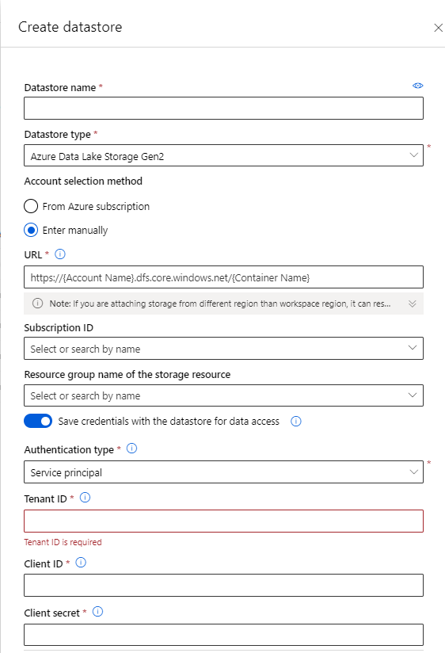

# Premier Analysis using Azure Machine Learning

The aim of this project was first to investigate how a Data Scientist would use Azure Machine Learning to implement a typical CDC Data Hub machine learning project and second to roughly assess several AML fonctionalities relevant to CDC Data Hub.

## Overview

This works describe how to reproduce the premier analysis using Azure Machine Learning (AML) platorm.
The aim of the project was to evaluate different machine learning models for predicting outcomes among COVID-19 inpatients using raw EHR data.The objective is to predict 3 outcomes : intensive care unit (ICU) admission, hyperinflammatory syndrome (HS), and death.

For more information on the machine learning problem, the models used and model training flow used by the original authors please consult the  master repository:  https://github.com/cdcai/premier_analysis and the pre-print manuscript : "Evaluation of machine learning for predicting COVID-19 outcomes from a national electronic medical records database [https://www.medrxiv.org/content/10.1101/2022.04.13.22273835v1]"

## Setting up the Workspace

This work is intended to be a proof of concept for a CDH use case, you need to run it in the CDH Resource Group in Azure. You will need access to the CDH ressource group and create a workspace.

## Create a compute instance

To work or run the code using a local VM, we recommend to use at least a compute instance of size **Standard_DS12_v2**
You can also run this code from your computer by connecting to AML from Visual Studio Code (Vs Code)using the Vs Code Azure Machine Learning extension.

## Get the Code

The code is avaialble on the github repo in the branch **azure_ml**. Make sure you clone and checkout that branch.

```
git clone https://github.com/mayerantoine/premier_analysis
cd premier_analysis
git branch -a
git checkout azure_ml
```

## Create a reference to the data

For this experiment the data is located in the EDAV Azure Data Lake Storage Gen 2. You will need to create a **datastore** referencing the premier data in the Data Lake. For that you will need a **service principal**.



You will need to note the name and path of the premier data location to run the scripts.

## Run the scripts locally on the compute instance

Once you have access to the data:


*   Create the conda environment for premier analysis
*   Download the data using the **01_download_data.ipynb** notebook
*   Run the bash scripts


## Run Training jobs Experiments

First, you need to set your environment parameters  : workspace name, resource group, subscription id.
To run AML training jobs you do not need to download the data on the compute instance.
you can go in the folder azure_ml and run the followwing notebooks :

*   **02_prepare_feature_data.ipynb** : Create 3 jobs to extract features and prepare the data
*   **03_experiments_baseline.ipynb** : Create experiments and run  training jobs for each baseline model and for each outcome.
*   **04_experiments_model.ipynb** : Create experiments and run training jobs for each deep learning model and for each outcome.
*   **05_hyperparameters_tuning.ipynb** : Example running hyperparameter tuning on the LSTM model


## Publish and Run Machine learning pipeline

Instead of running a job for each step you can stitch all the preprocessing and training steps into one scalable azure machine learning pipeline. To do this run the notebook : **06_build_pipeline.ipynb**. Ths notebook will create an publish an AML pipeline to train and register a LSTM or DAN Model.

Then you use the notebook **07_batch_inference.ipynb** to test batch inference job specifically for the DAN Model.

## Automated ML

Azure Machine Learning provides extensive Auto ML capabilities. You can test AutoML for the baseline models by running notebook **08_automl_baseline.ipynb**.
